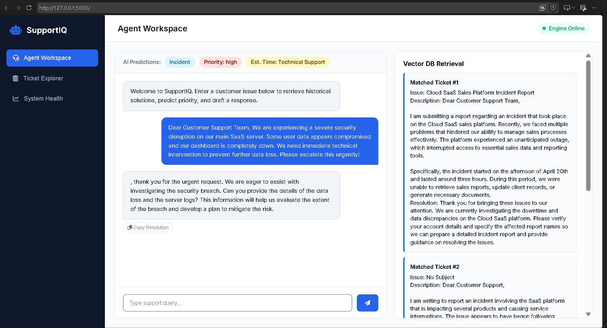
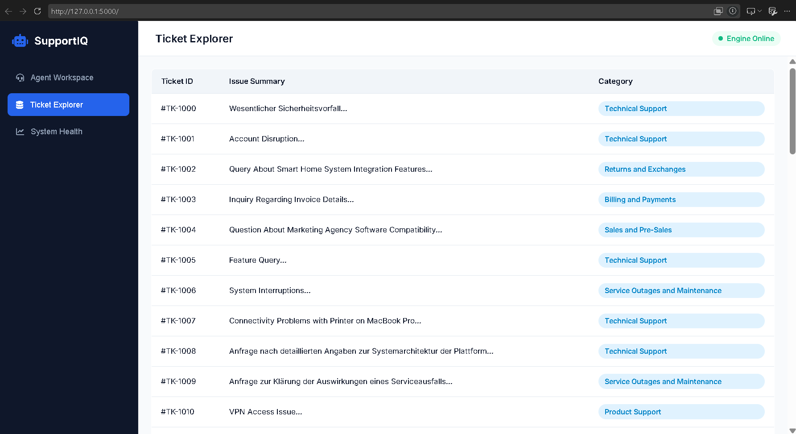
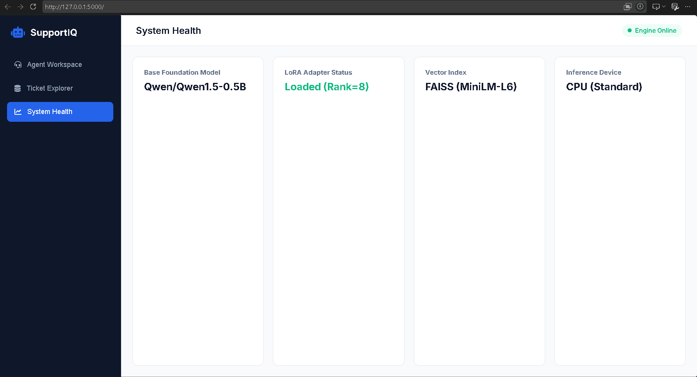

# SupportIQ 🤖💬
*An AI-powered customer support workspace that actually makes triage smart and fast.*

---

## 📸 Sneak Peek
*(A quick look at the SupportIQ workspace in action)*

| Agent Workspace & Predictions | Ticket Explorer Database | System Health Analytics |
| :---: | :---: | :---: |
|  |  |  |

*(Note: Drop your 3 screenshot images into a folder named `docs/images/` in your repository matching these filenames: `workspace.png`, `database.png`, and `analytics.png`)*

---

## 💡 What Problem Does This Solve?

Customer support teams are constantly drowning in repetitive tickets. Human agents waste valuable time manually reading issues, guessing priorities, figuring out which department queue they belong to, and digging through old resolved tickets to find a fix. 

**SupportIQ solves this by acting as an intelligent co-pilot for support agents.** 
Instead of a human doing all the heavy lifting upfront, SupportIQ instantly ingests a new customer complaint and does three things in milliseconds:
1. **Routes & Prioritizes:** Predicts the urgency and department queue automatically.
2. **Retrieves History:** Pulls up past similar tickets using a vector search engine.
3. **Drafts the Fix:** Uses a fine-tuned language model to write a context-aware response so the agent can review and send it out immediately.

---

## 🧠 How It Works (The "Dual-Brain" Architecture)

I designed SupportIQ with a clean separation of concerns between traditional machine learning and generative AI:

* **Brain 1: Predictive Classification (Scikit-Learn)**  
  Incoming text is vectorized using TF-IDF and passed through three independent Logistic Regression models. It instantly predicts the ticket **Priority**, **Department Type**, and maps queue outputs to realistic Service Level Agreements (SLAs like "15 mins" or "1 hour").
* **Brain 2: Generative RAG (LangChain + Hugging Face)**  
  Using a FAISS vector store powered by `all-MiniLM-L6-v2` embeddings, the app scans past resolved tickets to find the top 3 most relevant matches. That historical context is fed into a fine-tuned local LLM to generate a precise, tailored resolution.

---

## 🛠️ Tech Stack

* **Machine Learning & NLP:** Python, Scikit-Learn, PyTorch, Hugging Face Transformers, LangChain, FAISS
* **Backend:** Flask REST API, Pandas, Joblib
* **Frontend:** HTML5, CSS3, JavaScript, Marked.js
* **Dev Tools:** Git, VS Code, Jupyter Notebooks

---

## 🚀 Getting Started Locally

If you want to spin this up on your own machine, follow these steps:

1. **Clone the repository:**
   ```bash
   git clone [https://github.com/Sid-heree/SupportIQ.git](https://github.com/Sid-heree/SupportIQ.git)
   cd SupportIQ
Install dependencies:

Bash
pip install -r requirements.txt
Run the Flask application:

Bash
python app.py
Open it in your browser:

Head over to http://127.0.0.1:5000/ and test out a support query!

👨‍💻 Author
Built with passion by Siddh Patel
